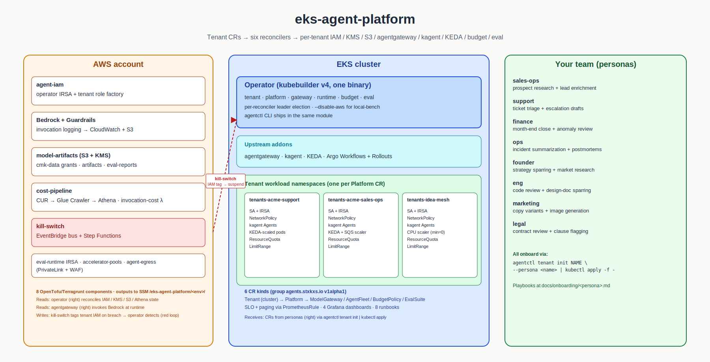

# Architecture

> _Two sources, pick the one that fits the edit:_
> _• [`assets/hero.svg`](./assets/hero.svg) — clean geometric SVG, the embedded asset above. Edit the XML directly for quick text / position changes._
> _• [`assets/hero.excalidraw`](./assets/hero.excalidraw) — Excalidraw source for the hand-drawn aesthetic. Open in [excalidraw.com](https://excalidraw.com) (drag-and-drop) or the VS Code Excalidraw extension; Export → SVG over the top of `hero.svg`._

| Doc                                                    | What                                                                                                                                     |
| ------------------------------------------------------ | ---------------------------------------------------------------------------------------------------------------------------------------- |
| [overview.md](./overview.md)                           | High-level: Tenant → Platform → ModelGateway / AgentFleet / Budget / Eval CR hierarchy + the AWS-side resources each provisions.         |
| [kill-switch-flow.md](./kill-switch-flow.md)           | Budget breach → EventBridge → Step Functions → IAM tag → operator detects → suspend + scale-to-zero.                                     |
| [eval-gating-flow.md](./eval-gating-flow.md)           | EvalSuite → Argo Workflow → eval-runner image → score → kubectl patch status.lastScore → Argo Rollouts AnalysisTemplate gates promotion. |
| [budget-reconcile-flow.md](./budget-reconcile-flow.md) | Hourly tick: Athena CUR rollup + CloudWatch in-flight + alert thresholds + EventBridge breach event.                                     |
| [multi-cluster.md](./multi-cluster.md)                 | Hub-and-spoke ArgoCD topology, per-cluster vs cluster-wide concerns, failover semantics.                                                 |

The hero above is hand-drawn (Excalidraw) for scannability. The four flow docs are Mermaid sequence diagrams for precision — render in any tool that supports it (GitHub, Notion, Obsidian, mermaid.live).

## Editing the hero

Two paths depending on the change:

- **Quick text / position tweak** — edit `assets/hero.svg` directly. It's hand-written, ~10KB, no library wrapping. GitHub re-renders on the next push.
- **Larger restructure or hand-drawn aesthetic** — open `assets/hero.excalidraw` in [excalidraw.com](https://excalidraw.com) (drag and drop) or the VS Code [Excalidraw extension](https://marketplace.visualstudio.com/items?itemName=pomdtr.excalidraw-editor). Make changes, then **Export → SVG** over `assets/hero.svg`. The `.excalidraw` JSON stays as the editable source.

Commit `hero.svg` whenever it changes. Keep `hero.excalidraw` in sync if you used the Excalidraw path; otherwise leave it as the structural reference.
