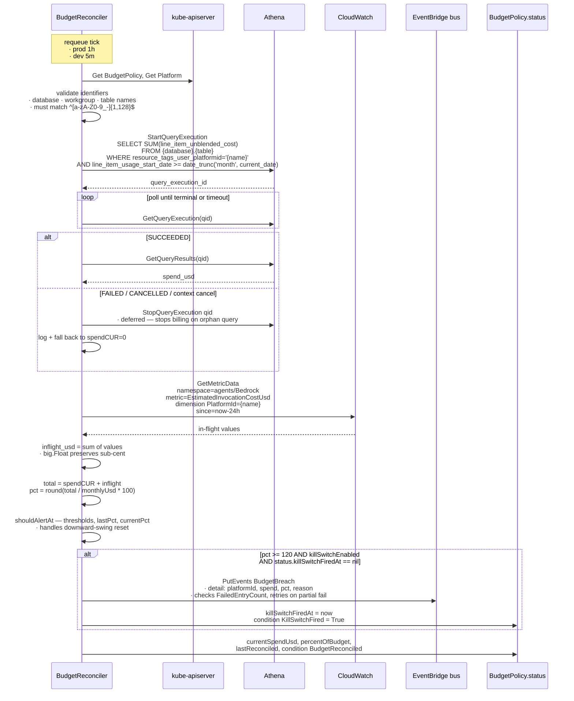
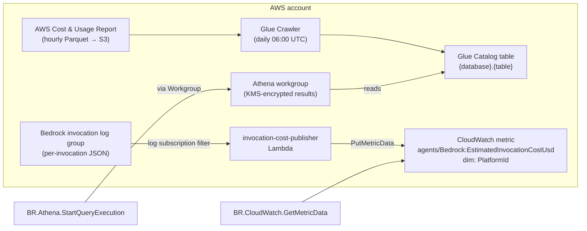

# Architecture — Budget reconcile flow

How `BudgetPolicy.status` gets populated each hour. The reconcile is on a timer (not Watch-driven) because spend doesn't change in a way that maps to k8s events — it accumulates continuously, and the reconciler reads aggregates.

## Tick

## Where the inputs come from

## Why two data sources

| Source                         | Latency                                        | Accuracy                                                                   |
| ------------------------------ | ---------------------------------------------- | -------------------------------------------------------------------------- |
| CUR (via Athena)               | ~24h lag (AWS publishes hourly + ~6h backfill) | authoritative; matches invoice                                             |
| CloudWatch metric (via Lambda) | seconds                                        | estimate (rounded conservatively up via the Lambda's per-1k pricing table) |

The total spend reading is `CUR + CloudWatch`. The kill-switch is intentionally conservative: an estimate that trips slightly early at 120% is cheaper than discovering you breached after the CUR catches up 24h later.

## Operator IAM surface this consumes

| Action                                                                                                     | Resource                                            | Granted by                                             |
| ---------------------------------------------------------------------------------------------------------- | --------------------------------------------------- | ------------------------------------------------------ |
| `athena:StartQueryExecution`, `GetQueryExecution`, `GetQueryResults`, `StopQueryExecution`, `GetWorkGroup` | `arn:aws:athena:*:*:workgroup/<env>-<cluster>-cost` | `terraform/components/cost-pipeline` operator policy   |
| `glue:GetDatabase`, `GetTable`, `GetTables`, `GetPartitions`                                               | catalog + `<env>-<cluster>-cost-cost` database      | same                                                   |
| `s3:GetObject`, `PutObject`, `ListBucket`                                                                  | athena results bucket                               | same                                                   |
| `cloudwatch:GetMetricData`, `GetMetricStatistics`, `ListMetrics`                                           | `*`                                                 | same                                                   |
| `events:PutEvents`                                                                                         | kill-switch event bus ARN                           | `terraform/components/kill-switch` operator bus policy |

See [ADR 0003 — Threat model](../adr/0003-threat-model.md) for the full operator IAM surface enumeration.

## Failure modes

| Failure                                       | Reconciler behavior                                                                                                                    |
| --------------------------------------------- | -------------------------------------------------------------------------------------------------------------------------------------- |
| Athena workgroup not configured (SSM missing) | spendCUR falls back to 0, in-flight reading still used                                                                                 |
| CUR Crawler hasn't run (table doesn't exist)  | Athena query fails → spendCUR=0; runbook [`budget-stale.md`](../runbooks/budget-stale.md)                                              |
| Athena query timeout                          | StopQueryExecution defer fires, query stops billing, reconcile returns and retries next tick                                           |
| CloudWatch GetMetricData errors               | in-flight falls back to 0; CUR-only reading still recorded                                                                             |
| EventBridge PutEvents partial failure         | reconciler detects `FailedEntryCount > 0`, returns error, killSwitchFiredAt not stamped → retries on next tick (no silent breach drop) |
| Context cancel mid-poll                       | StopQueryExecution defer fires, returns context error                                                                                  |
