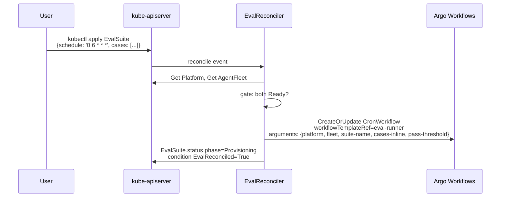
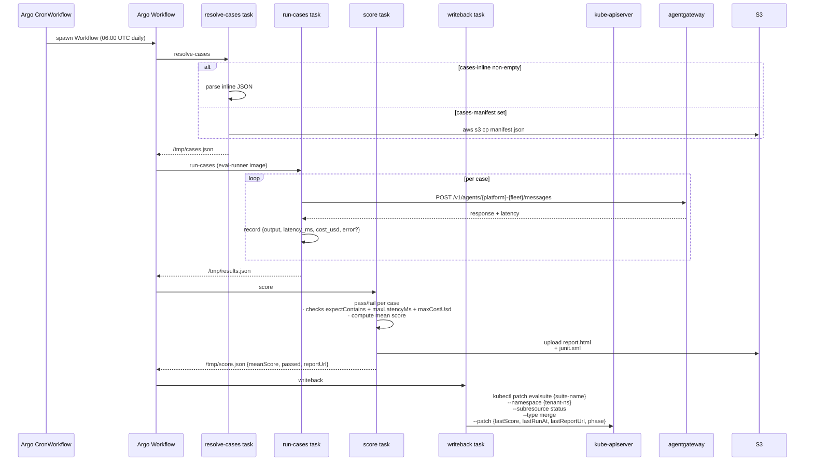
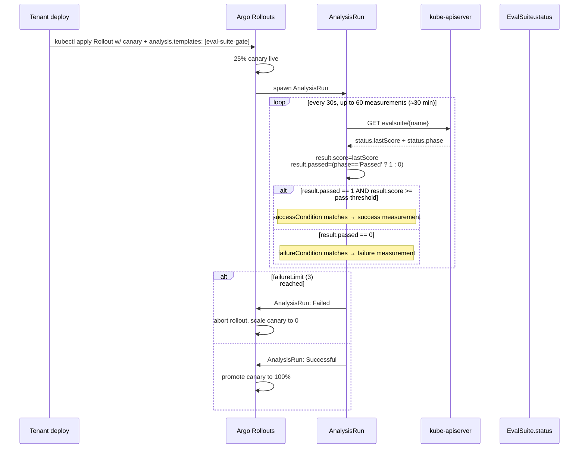

# Architecture — Eval gating flow

How an `EvalSuite` becomes a quality gate on a tenant's canary / blue-green deploy.

## Provisioning

## Execution

## Gating a rollout

## Critical: EvalSuite must be Ready BEFORE the rollout

The AnalysisRun polls `status.lastScore`. If the suite has never run (Provisioning), `lastScore` is empty and the gate sits at `initialDelay`. A 30m `initialDelay` is the runway; after that, the rollout aborts.

Practice: schedule the eval daily on a CronWorkflow, then any rollout the same day uses the most recent score as the gate. If the eval failed last night, the rollout fails fast; no canary traffic exposed to a regression.

See [ADR 0008 — Eval-runtime ships inside the operator chart](../adr/0008-eval-runtime-operator-chart.md) for why the WorkflowTemplate ships in `charts/operator` behind the `evalRuntime.*` toggles. See [charts/operator/files/eval-runtime/analysis-template.yaml](../../charts/operator/files/eval-runtime/analysis-template.yaml) for the literal AnalysisTemplate spec.
