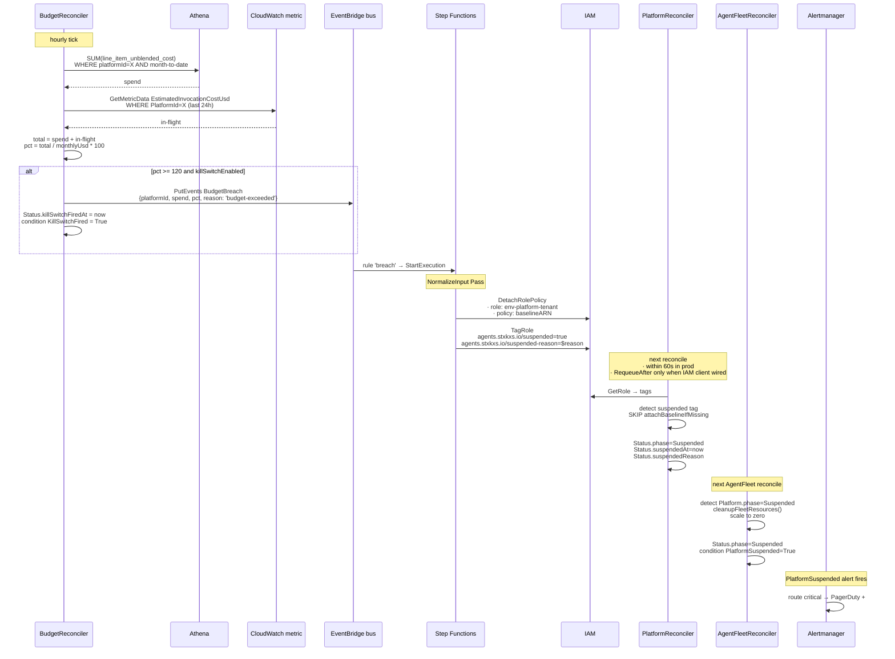
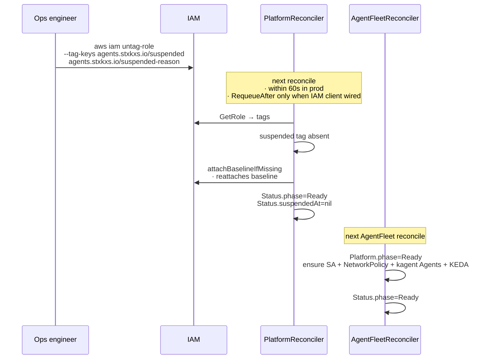

# Architecture — Kill-switch flow

End-to-end: budget breach detected → tenant access revoked → fleet scaled to zero → page fired. Loop closes when ops removes the IAM tag.

## Flow

## Recovery flow

**No CR mutation required for recovery.** The IAM tag is the on/off switch; the operator reconciles to it.

See [runbooks/platform-suspended.md](../runbooks/platform-suspended.md) for the human-facing playbook including how to verify the spend reading is real before un-suspending.

## Why IAM-tag-based suspension (not k8s-side)

The kill-switch fires from EventBridge, which doesn't speak Kubernetes. Two architectural options:

1. **Lambda subscribed to the event publishes to k8s API** — needs IRSA + cross-cluster auth, brittle for multi-cluster.
2. **Modify AWS state, operator detects drift** — what we shipped. The SFN modifies IAM (which it can); the operator's existing reconcile loop detects the IAM tag and propagates to k8s state.

The second is more loosely coupled. The trade-off: detection lag is the operator's reconcile interval (60s in production). For a 120% budget breach this is fine — the human-meaningful clock is the next page, not the millisecond.

See [ADR 0003 — Threat Model + Cross-component contracts](../adr/0003-threat-model.md#cross-component-contract-kill-switch-suspension-marker) for the canonical tag-key contract.
