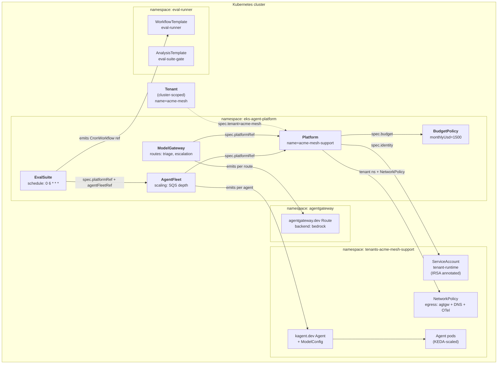
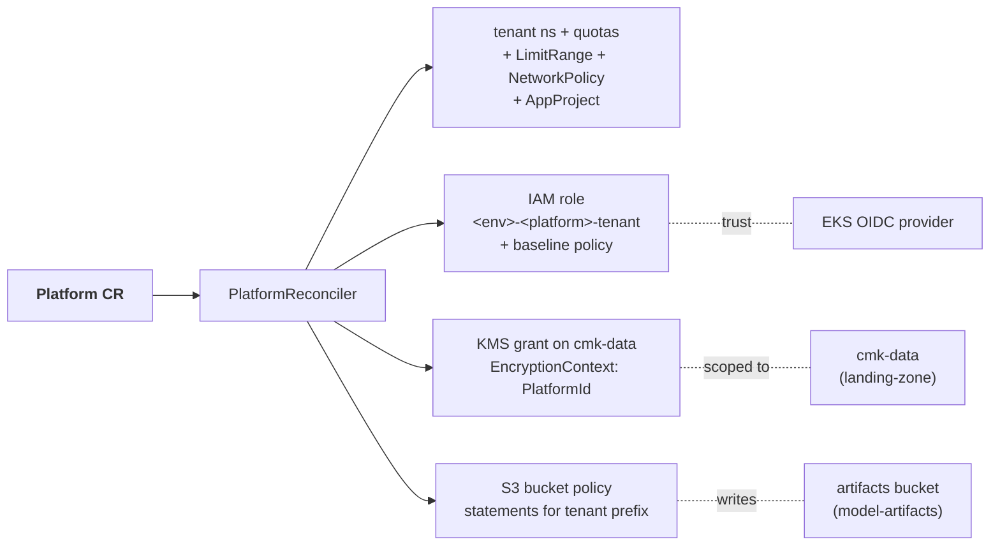
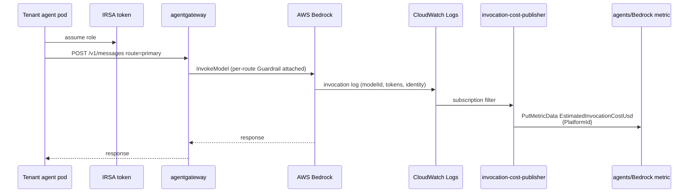

# Architecture — Overview

## CR hierarchy

`Tenant` is cluster-scoped; everything else lives in the management namespace (`eks-agent-platform` by convention). The operator provisions a per-Platform tenant workload namespace (`tenants-<platform>`) where agent pods + the SA actually run.

## AWS-side resources per Platform

## End-to-end invocation path

## Reconciler responsibilities

| Reconciler | Watches                                               | Emits / mutates                                                                                                 | Re-queue cadence                                                 |
| ---------- | ----------------------------------------------------- | --------------------------------------------------------------------------------------------------------------- | ---------------------------------------------------------------- |
| `tenant`   | Tenant + Platform + BudgetPolicy events (via Watches) | Tenant.status aggregate                                                                                         | 5m fallback                                                      |
| `platform` | Platform                                              | tenant ns, quotas, NetworkPolicy, AppProject, IAM role, KMS grant, S3 bucket policy statements                  | 60s when IAM wired (drift detection for kill-switch tag)         |
| `gateway`  | ModelGateway                                          | agentgateway Route per ModelRoute                                                                               | 30s when Pending (waiting on agentgateway CRDs / Platform Ready) |
| `runtime`  | AgentFleet                                            | tenant SA, fleet NetworkPolicy, kagent Agent + ModelConfig per agent, KEDA ScaledObject + TriggerAuthentication | 30s when Pending                                                 |
| `budget`   | BudgetPolicy                                          | status.{currentSpend, percentOfBudget, lastReconciled}, EventBridge breach event at 120%                        | configurable (1h prod, 5m dev)                                   |
| `eval`     | EvalSuite                                             | Argo Workflow / CronWorkflow with workflowTemplateRef=eval-runner                                               | 30s when Pending                                                 |

## Where state lives

| State                            | Source of truth                                                                                                                |
| -------------------------------- | ------------------------------------------------------------------------------------------------------------------------------ |
| Per-tenant access control        | IAM role tags (operator reads `agents.stxkxs.io/suspended`)                                                                    |
| Per-tenant data encryption scope | KMS grant `EncryptionContext: {PlatformId}`                                                                                    |
| Per-tenant S3 isolation          | bucket policy statements with `s3:prefix` condition                                                                            |
| Per-tenant Bedrock spend         | CUR Athena table (`resource_tags_user_platformid`) + in-flight CloudWatch metric (`agents/Bedrock:EstimatedInvocationCostUsd`) |
| Per-fleet scaling target         | KEDA ScaledObject (`aws-sqs-queue` when QueueURL set, else CPU)                                                                |
| Per-suite eval result            | EvalSuite.status (written by eval-runner Workflow via kubectl patch)                                                           |
