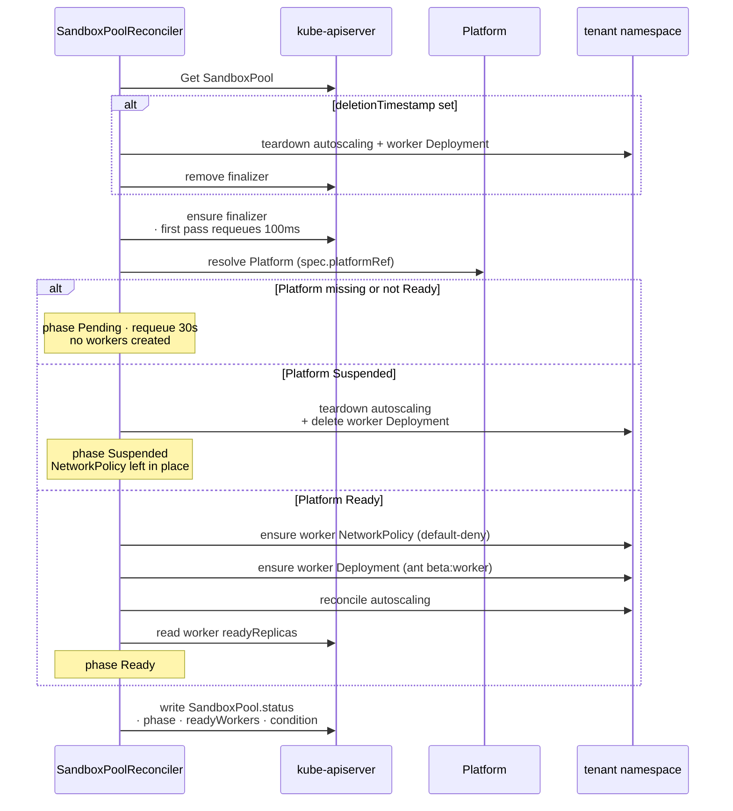
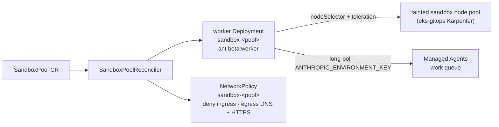
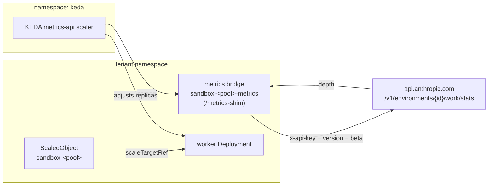

# Architecture — Sandbox reconcile flow

How a `SandboxPool` becomes a running pool of Managed Agents self-hosted sandbox workers.

A `self_hosted` Managed Agents environment dispatches agent tool-execution work to workers you host instead of running it on Anthropic-managed infrastructure. `SandboxPool` is the CR that runs those workers — as a Deployment inside a Platform's tenant namespace, locked down by a default-deny NetworkPolicy and autoscaled on the environment's work-queue depth.

Unlike the AWS-backed reconcilers, `SandboxPoolReconciler` is k8s-only — it makes no AWS or Anthropic API calls. Every object it touches is a cluster resource.

## Reconcile

The reconcile gates entirely on the owning Platform: a missing or not-Ready Platform holds the pool at `Pending`; a `Suspended` Platform (the budget kill-switch) tears the workers down without removing the NetworkPolicy, so recovery doesn't reopen the namespace. See [kill-switch-flow.md](./kill-switch-flow.md) for how a Platform reaches `Suspended`.

## Worker pool

The worker Deployment runs Anthropic's `ant beta:worker` — each pod long-polls the environment's work queue and executes agent tool calls. Worker pods land on the dedicated, tainted sandbox node pool that `eks-gitops` provisions via Karpenter: the `agents.stxkxs.io/sandbox` label plus a matching `NoSchedule` taint keep sandbox workloads off the nodes that run operator, system, or other tenant pods.

## Autoscaling

Worker count tracks the work-queue depth through KEDA. The signal is `depth` from `GET /v1/environments/{id}/work/stats` — CPU is the wrong signal, because a poll-based worker is latency-bound and mostly idle while it waits on the model.

KEDA's `metrics-api` scaler can send only one auth header; that Anthropic endpoint needs three (`x-api-key`, `anthropic-version`, `anthropic-beta`). A small in-cluster **metrics bridge** stands between them — it holds the organization API key, calls the upstream with all three headers, and re-serves the queue depth as plain JSON the scaler can read.

Autoscaling engages only when the pool sets `spec.apiKeySecret` (the org key the bridge needs) **and** the operator was started with `--shim-image` (the operator image, which carries the bridge binary). Otherwise the pool runs at a static replica count — `spec.scaling.minReplicas`, floored at 1 — and any existing autoscaling machinery is torn down. A cluster without KEDA installed is not an error: the ScaledObject step is skipped non-fatally and the pool runs static.

The bridge validates that the upstream answered `200` with a numeric `depth`. On any error it returns a non-2xx, so KEDA holds the current replica count rather than reading a misleading `depth: 0` and scaling the pool to zero on a transient API failure.

## Security posture

The self-hosted sandbox runs **untrusted code** — agent tool calls — inside your cluster. The baseline posture is locked down out of the box; the hardening dials take it to the regulated-enterprise bar. The architecture is the same either way — the dials are configuration, not a different design.

### Baseline — always on

| Control                 | What                                                                                                                                                                                                                                                 |
| ----------------------- | ---------------------------------------------------------------------------------------------------------------------------------------------------------------------------------------------------------------------------------------------------- |
| Pod Security            | Worker pods meet the Pod Security `restricted` profile: `runAsNonRoot`, `seccompProfile: RuntimeDefault`, `allowPrivilegeEscalation: false`, all capabilities dropped.                                                                               |
| No ServiceAccount token | `automountServiceAccountToken: false` — a compromised tool call holds no in-cluster API credential.                                                                                                                                                  |
| Network isolation       | A default-deny `NetworkPolicy`: ingress denied entirely; egress only to kube-dns and outbound HTTPS. The cloud instance-metadata endpoint (`169.254.169.254/32`) is excluded from the egress range, so tool calls cannot reach node IAM credentials. |
| Node isolation          | Worker pods run on a dedicated, tainted node pool — never colocated with operator, system, or other tenant workloads.                                                                                                                                |
| Key scoping             | Worker pods carry only `ANTHROPIC_ENVIRONMENT_KEY`, scoped to one environment's work queue. The organization API key (`apiKeySecret`) is mounted only into the metrics bridge — never a worker — so agent tool calls cannot reach it.                |
| Ephemeral workspace     | `/workspace` is an `emptyDir` — nothing persists across a pod restart.                                                                                                                                                                               |

### Hardening dials

| Dial                    | Default                                         | Turn it up                                                                                                                                                            |
| ----------------------- | ----------------------------------------------- | --------------------------------------------------------------------------------------------------------------------------------------------------------------------- |
| `spec.runtimeClassName` | cluster default runtime (`runc`)                | Set `gvisor` or `kata` for kernel-level isolation of the untrusted tool code. The named RuntimeClass must already exist in the cluster (an `eks-gitops` addon).       |
| Image provenance        | the published `sandbox-worker` image            | Verify the worker image signature with a Kyverno policy (`eks-gitops`); pin `spec.image` to a digest.                                                                 |
| Secret delivery         | raw `Secret` objects                            | Populate `environmentKeySecret` / `apiKeySecret` from an external store via the External Secrets Operator (`eks-gitops`).                                             |
| Egress                  | HTTPS to any address bar the metadata endpoint  | A plain NetworkPolicy cannot match an FQDN; route worker egress through an inspecting egress gateway (`eks-gitops`) to constrain and audit it to `api.anthropic.com`. |
| Audit / SIEM            | operator + pod logs to the cluster log pipeline | Forward sandbox-namespace logs and Kubernetes audit events to your SIEM through the observability stack (`eks-gitops`).                                               |

Mid-enterprise runs the defaults. A regulated tenant turns the dials up — the `SandboxPool` contract is unchanged. See [ADR 0003 — Threat model](../adr/0003-threat-model.md) for the platform-wide threat enumeration.

## Failure modes

| Failure                                      | Reconciler behavior                                                                                                                     |
| -------------------------------------------- | --------------------------------------------------------------------------------------------------------------------------------------- |
| Platform missing or not Ready                | phase `Pending`, requeue 30s; no workers created                                                                                        |
| Platform `Suspended`                         | autoscaling and the worker Deployment torn down; phase `Suspended`. The NetworkPolicy is left in place                                  |
| KEDA CRDs absent                             | the ScaledObject step is skipped non-fatally; the pool runs at its static replica count                                                 |
| `apiKeySecret` unset or `--shim-image` empty | autoscaling disabled; worker count held at `scaling.minReplicas` (floored at 1)                                                         |
| metrics bridge unreachable / Anthropic error | the bridge returns a non-2xx; KEDA holds the current replica count rather than scaling to zero on a bad reading                         |
| pool name longer than 47 characters          | the metrics bridge resource names exceed the 63-character limit and fail to create — keep `SandboxPool` names to 47 characters or fewer |
